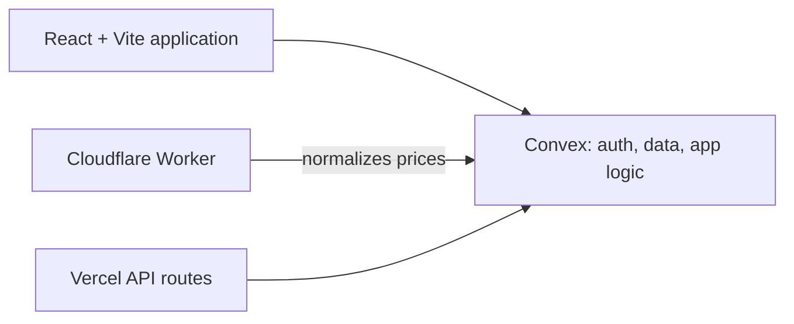

# Poscal

Trading tools for forex traders: position sizing, trade journaling, market-price snapshots, and supporting workflow features.

Poscal is a product project, not financial advice. Calculations and price data should be independently verified before making trading decisions.

## What it does

- Calculates position sizes from account, risk, instrument, and stop-loss inputs
- Lets traders record, review, and analyse trades
- Displays normalized shared market-price snapshots
- Provides authentication, notifications, and subscription/payment-related flows

## Architecture



The pricing worker fetches vendor prices, normalizes bid, ask, mid, and timestamp values, then writes a shared snapshot to Convex. Clients read that snapshot rather than each browser polling price vendors independently.

## Stack

React · TypeScript · Vite · Convex · Cloudflare Workers · Vitest · Playwright

## Run locally

```bash
npm install
npm run convex:dev
npm run dev
```

The frontend is served at `http://localhost:8080`. Configure the necessary Convex and optional Vercel environment values before using connected features; see [`.env.vercel.example`](.env.vercel.example).

## Checks

```bash
npm run lint
npm run typecheck
npm test
npm run test:coverage
npm run build
```

End-to-end tests need the local app and their required services available:

```bash
npm run test:e2e
```

The GitHub Actions workflow runs linting, type checking, unit tests with coverage, build verification, and browser tests.

## Documentation

- [Documentation index](docs/README.md)
- [Ask-price implementation notes](docs/ASK_PRICE_IMPLEMENTATION.md)
